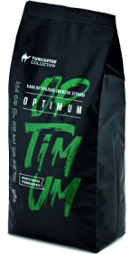

[Сторінка продукту](#Сторінка-продукту)
[Залогінений юзер](#Авторизація)


# Айтем продукту
стандартний айтем 

```
 <div class="item">
    <div class="item-wr">
        <div class="stocks">
          <span class="new-stock_text">new</span>
            <span class="new-discount_text">Знижка</span>
        </div>
        <div class="set-favourite">
            <a href="" class=""></a>
        </div>
        <div class="img">
            <a href="">
                
            </a>
        </div>
        <p class="item-title">
            <a href="" title="" tabindex="0">Кава мелена Elite</a>
        </p>
        <div class="middle-block">
            <div class="rating" data-rate="50">
                <span class="rateStarPopup"></span>
                <span class="rateStarPopup"></span>
                <span class="rateStarPopup"></span>
                <span class="rateStarPopup"></span>
                <span class="rateStarPopup"></span>
            </div>

        </div>
        <div class="not-available-block">
            <p>немає в наявності</p>
            <a href="">Повідомити про наявність</a>
        </div>
        <div class="item-kinds colors">
           <a href="#" class="state-active"><span style="background: #979A9A"></span></a>
            <a href="#" class=""><span style="background: #979A9A"></span></a>
             <a href="#" class=""><span style="background: #979A9A"></span></a>
        </div>
        <div class="item-kinds weights">
            <a href="" class=""><span>0.1 кг</span></a>
            <a href="" class=""><span>0.25 кг</span></a>
            <a href="" class="state-active"><span>1 кг</span></a>
        </div>

        <div class="bottom-block">
            <div class="product-counter-prices">
                <div class="counter">
                    <button class="minus" tabindex="0">-</button>
                    <input type="text" id="" value="1" name="" data-step="1" inputmode="numeric" tabindex="0">
                    <button class="plus" tabindex="0">+</button>
                </div>
                <div class="product-prices">
                    <p class="product-price">182 <span>грн</span></p>
                    <div class="product-price-old">
                        <div class="product-price-old-container">
                            <p>210 <span>грн</span>
                            </p>
                        </div>
                    </div>
                </div>
            </div>
            <button class="add-to-cart">
            </button>
        </div>
        <button class="make-order">Замовити</button>

    </div>
 </div>
```
---

# link
# Різні стани товару
Все керується додаванням класу до div.item

- клас pr__origin - товар без кольорів і різних фасувань
- клас pr__weight - товар з різними фасуваннями
- клас pr__colors - товар з різними кольорами 
- клас not-available - робить товар неактивним (немає в наявності)
- клас discount - Показує маркер що товар зі знижкою.  відображає акційну і стару ціну
- клас pr_new - показує маркер *новинка*


На картинці показано можливі варіанти вигляду товару, а в списку класи які треба додати.
По дефолту має завжди бути клас item і якись з нище перелічених(без них товар буде криво відображатись):

1) pr__origin має вийти ```<div class="item pr__origin">```
2) pr__weight not-available має вийти ```<div class="item pr__weight not-available">```
3) pr__colors має вийти ```<div class="item pr__colors">```
4) pr__weight має вийти ```<div class="item pr__weight">```
5) pr__colors not-available має вийти ```<div class="item pr__colors not-available">```
6) pr__origin not-available має вийти ```<div class="item pr__origin not-available">```
 
 
---
# блок з акціями (*червоні маркери на товарі)
Поки що було тільки 2 акційні маркери знижка і новинка. 
```
<div class="stocks">
   <span class="new-stock_text">new</span>
   <span class="new-discount_text">Знижка</span>
</div>
```
---
# Рейтинг товару
в data-rate вставляти рейтинг у % (в прикладі 50%) далі js-ом все обробиться
```
<div class="middle-block">
            <div class="rating" data-rate="50">
                <span class="rateStarPopup"></span>
                <span class="rateStarPopup"></span>
                <span class="rateStarPopup"></span>
                <span class="rateStarPopup"></span>
                <span class="rateStarPopup"></span>
            </div>
</div>
```
---
# Неактивний товар
Блок який відобразиться коли товар неактивний
```
 <div class="not-available-block">
            <p>немає в наявності</p>
            <a href="">Повідомити про наявність</a>
        </div>
```    
нище по коду буде ще кнопка 
 
```
<button class="make-order">Замовити</button>
```
---

# Блок з кольором і вагою

цей блок відповідає за різновиди кольору. в span в style треба закидувати колір товару

Клас state-active в <a> показує якого кольору товар відображається.( в дизайні кружочок активного кольору має активний стан.) 

```
<div class="item-kinds colors">
            <a href="#" class="state-active"><span style="background: #979A9A"></span></a>
            <a href="#" class=""><span style="background: #979A9A"></span></a>
             <a href="#" class=""><span style="background: #979A9A"></span></a>
 </div>
```
 
цей блок відповідає за різновид по масі упакування      
Клас state-active в <a> показує якої фасовки товар зараз відображається( в дизайні цифра 'активної' фасовки має активний стан.) 

```
        <div class="item-kinds weights">
            <a href="" class=""><span>0.1 кг</span></a>
            <a href="" class=""><span>0.25 кг</span></a>
            <a href="" class="state-active"><span>1 кг</span></a>
        </div>
```

Ці два блоки можна відображати одночасно, css сховає лишнє

---

# Ціна товару
в div.product-price-old-container стара ціна. в div.product-price актуальна ціна. якщо немає акції то відображається ціна в div.product-price
```
<div class="product-prices">
                    <p class="product-price">182 <span>грн</span></p>
                    <div class="product-price-old">
                        <div class="product-price-old-container">
                            <p>210 <span>грн</span>
                            </p>
                        </div>
                    </div>
 </div>
 ```
# Інше
в кінці футера, перед скріптами є section.text-templates
в цьому блоці шаблони для підсказок в товарі (наведи на сердечко, кошик). Вивів це в html для зручності переводу на різні мови


---

# Сторінка продукту
## Фото продукту

в ```<a href="./images/temp/product-item500x500.jpg" class="item">  вставляється велика картинка (буде відкриватись на весь екран)```
 в `````` вставляється маленька картинка, ну або та ж сама велика
 в ``` <div class="product__media-360"> ``` тут 360 і відеоогляд товару. якщо нема то повність не виводиш div.product__media-360
```
               <div class="product__media">
                        <div class="product__media-main__img">
                            <a href="./images/temp/product-item500x500.jpg" class="item">
                                
                            </a>
                            <a href="./images/temp/product-img3.jpg" class="item">
                                
                            </a>
                            <a href="./images/temp/product-img2.jpg" class="item">
                                
                            </a>
                        </div>
                    <div class="product__media-360">
                        <div class="item item-360">
                            <div class="item-in">
                                
                            </div>
                        </div>
                        <div class="item item-video">
                            <div class="item-in">
                                
                            </div>
                        </div>
                    </div>
                    <div class="product__media-thumbs">
                        <div class="item">
                            <div class="item-in">
                                
                            </div>
                        </div>
                        <div class="item">
                            <div class="item-in">
                            
                        </div>
                        </div>
                        <div class="item">
                            <div class="item-in">

                            
                        </div>
                        </div>
                    </div>
            </div>

```
## Акції
Тут так само як і в акціях в каталозі
до section.product-page додаються класи
1) discount - якщо є знижка + там де ціна вивести альтернативну ціну. css все відобразить
2) pr_new - якщо товар новинка
3) not-available - якщо товару нема в наявності + 
                                                  в коді є div
                                                  ```
                                                   <div class="not__available">
                                                      <p>Немає в наявності</p>
                                                      <button class="make-order">Замовити</button>
                                                    </div>
                                                   ```
                                                  тут або button - якщо буде попап або``` <a>``` якщо посилання 

## Кольори, вага
виводити або ```<div class="item-kinds colors"> ```
 або
```<div class="item-kinds weights">```
 або
 нічого (якщо нема ні кольорів, ні ваг) (залишаєш <div class="product-kinds"> пустим - не видялаєш його)
```
<div class="product-kinds">
                <div class="item-kinds colors">
                    <a href="" class="state-active" tabindex="0"><span style="background: #979A9A"></span></a>
                    <a href="" class="" tabindex="0"><span style="background: #979A9A"></span></a>
                </div>
                <!--<div class="item-kinds weights">-->
                    <!--<a href="" class="" tabindex="0"><span>0.1 кг</span></a>-->
                    <!--<a href="" class="" tabindex="0"><span>0.25 кг</span></a>-->
                    <!--<a href="" class="state-active" tabindex="0"><span>1 кг</span></a>-->
                <!--</div>-->
            </div>
```

## Відео

ця конструкція передбачена для відео з ютубу. Це потрібно щоб воно прогружалось лише в випадку коли користувач дійсно хоче його подивитись (економія трафіку)

В ```<a>``` class video__link вставляти посилання на відео
```
<div class="product__part4">
                <div class="video">
                    <a class="video__link" href="https://www.youtube.com/watch?v=2sdIzYBoTO4&ab_channel=Arzum">
                        <picture>
                            <source srcset="" type="image/webp">
                            
                        </picture>
                    </a>
                    <button class="video__button" aria-label="Запустити відео">
                        <svg width="68" height="48" viewBox="0 0 68 48"><path class="video__button-shape" d="M66.52,7.74c-0.78-2.93-2.49-5.41-5.42-6.19C55.79,.13,34,0,34,0S12.21,.13,6.9,1.55 C3.97,2.33,2.27,4.81,1.48,7.74C0.06,13.05,0,24,0,24s0.06,10.95,1.48,16.26c0.78,2.93,2.49,5.41,5.42,6.19 C12.21,47.87,34,48,34,48s21.79-0.13,27.1-1.55c2.93-0.78,4.64-3.26,5.42-6.19C67.94,34.95,68,24,68,24S67.94,13.05,66.52,7.74z"></path><path class="video__button-icon" d="M 45,24 27,14 27,34"></path></svg>
                    </button>
                </div>
            </div>
```
Якщо потрібно вставляти інші відео(не з ютубу) ось така конструкція
```

<div class="product__part4">
                <div class="video video--enabled">
                <iframe src=''>
                </iframe>
                 </div>
</div>
```

якщо ж відео нема то не виводити блок div.product__part4


---
# Авторизація

Для пк і моб. різні блоки. В пк версії - блок в хедері. В моб версії - блок в меню.

Пк версія:
до ``` <div class="auth"></div> ``` додається клас authorized щоб вийшло ```<div class="auth authorized"></div> ```

В оновленій версії в цьому діві є ``` <div class="authorized__block"> ``` в ньому розмітка для авторизованого юзера.


В ```<div class="user__status__block">``` є  data-percent="50" - сюди вписується прогрес акаунту (клієнт - партнер - ...)  у % 

Моб. версія.
В меню є  ```<div class="menu-main-top-auth">``` До нього додається клас authorized щоб вийшло   ```<div class="menu-main-top-auth authorized">```

Далі все так само як на пк.

Посилання ``` <a href="" class="custom-link">Вхід</a> <a href="" class="custom-link">Реєстрація</a> ``` можна залишати, вони ховаються css-ом


---
# Корзина

айтем товару ```<div class='cart_item'> ``` аналогічно до інших сторінок різновиди товарів (кольори, вага, знижка...)
До  ```<div class='cart_item'> ``` додається клас:
1) pr__origin має вийти ```<div class="cart_item pr__origin">```
2) pr__colors має вийти ```<div class="cart_item pr__colors">```
3) pr__weight має вийти ```<div class="cart_item pr__weight">```
4) discount - Показує маркер що товар зі знижкою.  відображає акційну ціну
5) pr_new - показує маркер *новинка*

Попап при кліку *додати замовлення*:
Таблиця товарів. Один айтем ```<div class="order_row"></div> ``` додаються такі самі класи які описані вище.

*Підібрати по акціям* слайдер товарів. такий самий як на головній()
